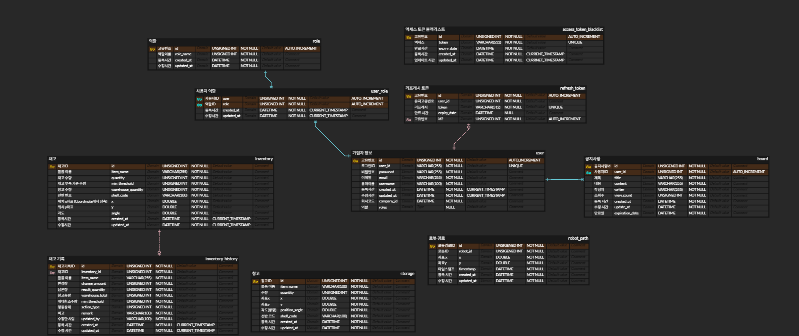
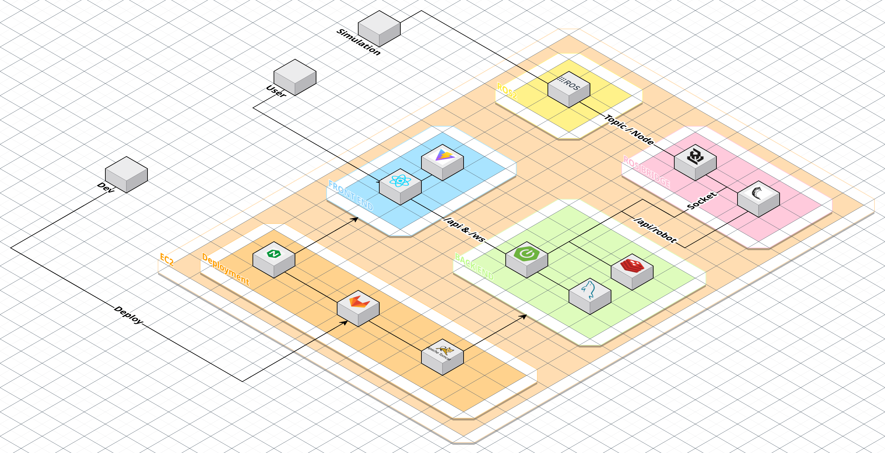

# README

# 🍁창고형 매장을 위한 물품 재고관리 및 자율주행 서비스 **웰던**

---

## ✅프로젝트 진행 기간

2025.03.04 ~ 2025.04.11(6주)

---

## 프로젝트 기획회의 및 규칙 정리 노션

[https://hushed-ferret-748.notion.site/Team-Project-Well-Done-1a46bc9b9c5580b59c19f875fd960071](https://www.notion.so/Team-Project-Well-Done-1a46bc9b9c5580b59c19f875fd960071?pvs=21)

---

## 🚩 서비스 한줄 소개

창고형 매장을 위한 물품 재고관리 및 자율주행 서비스

---

## 📌 개요

Well-Done은 창고형 매장에서 물품을 효율적으로 관리, 이동하는 서비스입니다.
시뮬레이터 내의 자율주행과 인식기술을 활용하여, 재고를 효율적으로 관리합니다.
재고 관리 및 최적 경로를 제공하며, 전체 매장의 관리 위한 세부정보를 제공합니다.

---

## 🌱 프로젝트 설명 및 목표

- 웰던은 창고형 매장에서 사용자의 편의를 향상시키며, 효율성을 향상 시키는 서비스입니다.
- 시뮬레이터 내에서 터틀봇이 이동할최적경로를 계산하고, YOLO를 통해 물건을 인식할 수 있습니다.
- 웹 페이지에서 로봇 경로를 실시간으로 시각화할 수 있으며, 로봇의 상태도 확인할 수 있습니다.
- 재고 가감이 생길 경우, 시뮬레이터를 통해 재고관리 자동화를 확인할 수 있습니다.

---

## 🛠️ 기술 스택

### **Front-End**

- Vite, React, Nginx

### **Back-End**

- Spring Boot, Flask, JPA

### **Database & Cache**

- MySQL, Redis

### **Infrastructure & DevOps**

- Docker, GitLab Runner, AWS EC2, Nginx

### Simulator

- **ROS2 (Eloquent)**: 로봇 운영 체제 기반 미들웨어 (Publisher/Subscriber 구조, 메시지 처리)
- **2D LiDAR (LaserScan)**: 거리 기반 장애물 감지 및 SLAM 기반 맵 생성
- **IMU (Inertial Measurement Unit)**: 자세 추정 및 오도메트리 보정
- **Odometry (속도 기반 위치 추정)**: IMU + 선속도/각속도를 통해 상대 위치 계산
- **SLAM (Simultaneous Localization and Mapping)**: 자율 매핑을 위한 동시적 위치 추정 및 지도 작성
- **YOLOv8 (Object Detection)**: 실시간 물체 인식 및 중심 좌표 추출
- **OpenCV**: 이미지 처리 및 라이다-카메라 정렬, 시각화에 사용
- **RViz2**: 로봇 상태, 맵, 경로 등의 시각화 툴
- RCLPY: ROS의 메시지를 json으로 변환해주는 라이브러리

---

## 🚀 주요 기능

### 📍 자율 주행 및 초기 매핑 기능

- 로봇은 **SLAM 기반**으로 환경을 스스로 탐색하고 지도를 생성합니다.
- **Frontier 탐색 알고리즘**을 기반으로 미개척 영역을 목표 지점으로 설정하여 이동합니다.
- 장애물이 근처에 있는 지점은 목표로 삼지 않으며, 도달 실패 시 새로운 프론티어를 재탐색합니다.
- **맵 커버리지가 90% 이상**이고 변화율이 낮으면 매핑을 종료합니다.
- 매핑 중 언제든지 **중단 명령**을 수신할 수 있으며, 정지 시점의 맵 데이터를 포함하여 백엔드에 전송됩니다.

---

### 📍 프론트 재고 → 창고 물품 교환

- 전시대의 재고가 0이 되면, 랙(EMP1, EMP2 등)의 빈 파레트를 가져가서 창고(LST1~10, RST1~10)에서 물건과 교환합니다.
- `PickPlaceCommand` 메시지를 통해 `from_id` (빈 파레트 위치), `to_id` (창고 물품 위치)를 지정합니다.
- FSM 기반 **pick-and-place 구조**를 통해 픽업, 정렬, 이동, 배치 흐름이 자동으로 수행됩니다.
- 물체 배치 시 로봇 현재 위치와 목적지 좌표 간 거리(**put_distance**)를 동적으로 계산하여 정밀 제어합니다.
- 모든 동작 완료 시 `/place_done` 메시지로 **성공 여부 및 맵 정보**를 백엔드에 전달합니다.

---

### 📍 랙 내 물품 위치 교환

- 동일한 랙 안 또는 다른 랙에 있는 두 물품의 위치를 **서로 바꿉니다**.
- 임시로 `EMP1`에 첫 번째 물건을 저장한 뒤, 두 번째 물건을 꺼내서 첫 번째 위치로 이동시킵니다.
- 이후 `EMP1`에 임시 저장한 첫 번째 물건을 다시 두 번째 자리로 배치합니다.
- 각 단계에서 **pick, place, 정밀 정렬 FSM**이 순차적으로 수행되며, 상태 메시지를 통해 동기화됩니다.

---

### 📍 정밀 정렬 기능 (Precise Alignment)

- 물건을 정확히 들어올리고 놓기 위해 **3단계 FSM 기반 정렬**을 수행합니다.
    1. 목표 방향으로 회전
    2. 일정 거리 전진
    3. 최종 목표 각도로 정밀 회전
- 정렬 허용 오차는 **5도 이내**로 설정되어 있으며, 전진 시 **속도 상한선 (예: 0.2 m/s)** 을 적용하여 과속을 방지합니다.
- 정렬 완료 여부는 `/alignment_done` 토픽을 통해 FSM에 전달됩니다.

---

### 📍 경로 생성 및 추적 기능

- A\*기반 글로벌 경로를 생성하고, 지역 경로는 주변 장애물을 고려하여 실시간으로 계산됩니다.
- `path_tracking` 노드는 `/odom`과 `/local_path`를 기반으로 실제 경로를 추적하며, 장애물 감지 시 **회피 FSM**이 작동합니다.
- 목표 지점에 도달하면 `/goal_reached` 메시지를, 실패 시 `/goal_failed` 메시지를 퍼블리시하여 상위 FSM에 알립니다.

---

## 🛴 통신 방식

### 📍 ROS Bridge

- **ROS2 실행을 위한 환경 변수 설정**

    `call C:\dev\ros2_eloquent\setup.bat`

- **워크스페이스에서 설치된 패키지를 사용하도록 설정**

    `call C:\Users\SSAFY\Desktop\temp\S12P21E102\sim\ros2_ws\install\local_setup.bat`

- **로스 브릿지 실행**

    `python -m RosBridge_Modulized.main`

### 📍 WebSocket

- 실시간 통신

### 📍 Rest API

- 1. **리소스 식별 (Resource Identification);; 이게 핵심**
    - **URI (Uniform Resource Identifier)**: RESTful API에서는 각 리소스를 **URI**로 식별합니다. 리소스는 **명사**로 표현하며, 가능한 한 **복수형**으로 사용합니다.
    - **리소스는 고유하게 식별 가능해야 합니다**. 예를 들어, `users`는 여러 사용자를 나타내고, `users/{userId}`는 특정 사용자를 나타냅니다.
- 2.  HTTP 메서드 사용 (HTTP Methods)
    - RESTful API에서는 **HTTP 메서드**를 **동사**로 사용하여 리소스에 대해 어떤 작업을 할지 정의합니다.
        - **GET**: 리소스를 조회 (Read)
        - **POST**: 새로운 리소스를 생성 (Create)
        - **PUT**: 기존 리소스를 업데이트 (Update)
        - **DELETE**: 리소스를 삭제 (Delete)
        - **PATCH**: 리소스의 부분 업데이트
    - 각 HTTP 메서드는 **적절한 작업을 수행**하도록 해야 하며, HTTP 상태 코드를 통해 요청 결과를 클라이언트에게 명확하게 전달합니다. 예를 들어:
        - `200 OK`: 성공적인 요청
        - `201 Created`: 리소스가 성공적으로 생성됨
        - `400 Bad Request`: 잘못된 요청
        - `404 Not Found`: 리소스가 존재하지 않음
        - `500 Internal Server Error`: 서버 에러
- 3. 무상태성 (Statelessness)
    - **상태 저장하지 않기**: RESTful API는 **무상태(stateless)**를 지향합니다. 즉, **서버가 클라이언트의 상태를 저장하지 않으며, 클라이언트가 각 요청마다 필요한 모든 정보를 포함하여 보냅니다**.
    - **상태 저장이 없으면 서버가 클라이언트의 이전 요청을 기억할 필요가 없으므로 서버가 더 효율적으로 동작할 수 있습니다**.
    - 클라이언트는 **각 요청에서 모든 필요한 정보(예: 인증 토큰)를 포함하여 보내야** 하며, 서버는 이를 기반으로 요청을 처리합니다.

---

## 👨‍💻 팀원

| 이름 | 역할 |
| --- | --- |
| 김지홍[팀장] | Back-End, Simulate |
| 김동현 | Back-End, Infra |
| 전민경 | Back-End |
| 이현석 | Simulate, Back-End |
| 정한균 | Simulate |
| 유지웅 | Front-End |

## 📌 역할 및 담당 업무

### 🖥️ Back-End

### 김지홍 [Back-End, Simulate] (팀장)

- MQTT 구현
- 시뮬레이터 인식 구현

### 김동현 [Back-End, Infra]

- 사내 공지 구현
- 인프라 구축

### 전민경 [Back-End]

- Spring Security 구현
- WebSocket 시그널링 서버 구축
- Redis 구현

### 🦾Simulate

### 이현석 [Simulate, Back-End]

- ROS Bridge 구현
- 시뮬레이터 맵 제작

### 정한균 [Simulate]

- 시뮬레이터 SLAM 구현
- 시뮬레이터 자율 주행 알고리즘 구현
- 시뮬레이터 물품 운반 알고리즘 구현

### 🎨 Front-End

### 유지웅 [Front-End]

- 기본 웹 페이지 생성

---

## 🏛️ ERD



---

## 🌐 시스템 아키텍처



---

## 📂 프로젝트 구조

### Back-end

```
+---be/src
├─main
│  └─java
│      └─com
│          └─be
│              │  BeApplication.java
│              │
│              ├─common
│              │  ├─aop
│              │  │      .gitkeep
│              │  │
│              │  ├─auth
│              │  │  │  .gitkeep
│              │  │  │
│              │  │  ├─model
│              │  │  │      .gitkeep
│              │  │  │
│              │  │  └─service
│              │  │          .gitkeep
│              │  │
│              │  ├─exception
│              │  │  │  .gitkeep
│              │  │  │
│              │  │  └─handler
│              │  │          .gitkeep
│              │  │
│              │  ├─model
│              │  │  └─response
│              │  │          .gitkeep
│              │  │          BaseResponseBody.java
│              │  │
│              │  └─util
│              │          .gitkeep
│              │
│              ├─config
│              │  │  .gitkeep
│              │  │  AdminInitializer.java
│              │  │  RedisConfig.java
│              │  │  RestTemplateConfig.java
│              │  │  SwaggerConfig.java
│              │  │  WebSocketConfig.java
│              │  │
│              │  ├─base
│              │  │      BaseException.java
│              │  │      BaseResponse.java
│              │  │      BaseResponseStatus.java
│              │  │
│              │  └─security
│              │          CustomAccessDeniedHandler.java
│              │          CustomAuthenticationEntryPoint.java
│              │          CustomAuthenticationFilter.java
│              │          CustomAuthFailureHandler.java
│              │          CustomAuthSuccessHandler.java
│              │          CustomLogoutHandler.java
│              │          CustomUserDetails.java
│              │          CustomUserDetailsService.java
│              │          JwtAuthorizationFilter.java
│              │          SecurityConfig.java
│              │
│              ├─connection
│              │  └─mqtt
│              │      ├─config
│              │      │      MqttConfig.java
│              │      │
│              │      ├─controller
│              │      │      MqttController.java
│              │      │
│              │      └─service
│              │              MqttService.java
│              │
│              ├─controller
│              │      HelloController.java
│              │
│              ├─db
│              │  ├─entity
│              │  │      .gitkeep
│              │  │      BaseEntity.java
│              │  │      Coordinate.java
│              │  │      Inventory.java
│              │  │      InventoryHistory.java
│              │  │      RobotPath.java
│              │  │      Role.java
│              │  │      Room.java
│              │  │      Storage.java
│              │  │      User.java
│              │  │
│              │  ├─repository
│              │  │      .gitkeep
│              │  │      InventoryHistoryRepository.java
│              │  │      InventoryRepository.java
│              │  │      RobotPathRepository.java
│              │  │      RoleRepository.java
│              │  │      RoomRepository.java
│              │  │      StorageRepository.java
│              │  │      UserRepository.java
│              │  │
│              │  └─service
│              │          .gitkeep
│              │          AuthService.java
│              │          InventoryDataLoader.java
│              │          StorageDataLoader.java
│              │
│              └─domain
│                  ├─auth
│                  │  │  WebSocketAuthInterceptor.java
│                  │  │
│                  │  ├─controller
│                  │  │      .gitkeep
│                  │  │      AdminController.java
│                  │  │      AuthController.java
│                  │  │      UserController.java
│                  │  │
│                  │  ├─dto
│                  │  │      .gitkeep
│                  │  │      LoginRequestDto.java
│                  │  │      LoginResponseDto.java
│                  │  │      UserDto.java
│                  │  │
│                  │  ├─request
│                  │  │      .gitkeep
│                  │  │      LoginRequest.java
│                  │  │      RegisterRequest.java
│                  │  │      UpdateUserRequest.java
│                  │  │
│                  │  ├─response
│                  │  │      .gitkeep
│                  │  │      LoginResponse.java
│                  │  │      RegisterResponse.java
│                  │  │
│                  │  ├─service
│                  │  │      .gitkeep
│                  │  │      TokenBlackListService.java
│                  │  │      TokenBlackListServiceImpl.java
│                  │  │
│                  │  └─utils
│                  │          TokenUtils.java
│                  │          ValidTokenDto.java
│                  │
│                  ├─board
│                  │  ├─controller
│                  │  │      BoardController.java
│                  │  │
│                  │  ├─dto
│                  │  │      BoardRequestDto.java
│                  │  │      BoardResponseDto.java
│                  │  │      ExpirationDateRequestDto.java
│                  │  │
│                  │  ├─entity
│                  │  │      Board.java
│                  │  │
│                  │  ├─exception
│                  │  │      GlobalExceptionHandler.java
│                  │  │
│                  │  ├─repository
│                  │  │      BoardRepository.java
│                  │  │
│                  │  └─service
│                  │          BoardService.java
│                  │
│                  ├─inventory
│                  │  ├─controller
│                  │  │      .gitkeep
│                  │  │      InventoryController.java
│                  │  │      InventoryHistoryController.java
│                  │  │
│                  │  ├─dto
│                  │  │      .gitkeep
│                  │  │      InventoryDto.java
│                  │  │      InventoryHistoryDto.java
│                  │  │      RobotCommandDto.java
│                  │  │      StockAlertDto.java
│                  │  │
│                  │  ├─request
│                  │  │      .gitkeep
│                  │  │
│                  │  ├─response
│                  │  │      .gitkeep
│                  │  │
│                  │  └─service
│                  │          .gitkeep
│                  │          InventoryHistoryService.java
│                  │          InventoryService.java
│                  │
│                  ├─robot
│                  │  │  RosBridgeClient.java
│                  │  │  SimulatorSocketHandler.java
│                  │  │  UserSocketHandler.java
│                  │  │
│                  │  ├─controller
│                  │  │      .gitkeep
│                  │  │      RedisController.java
│                  │  │      RobotController.java
│                  │  │
│                  │  ├─dto
│                  │  │      .gitkeep
│                  │  │
│                  │  ├─request
│                  │  │      .gitkeep
│                  │  │
│                  │  ├─response
│                  │  │      .gitkeep
│                  │  │
│                  │  └─service
│                  │          .gitkeep
│                  │          RedisService.java
│                  │          RobotLocationService.java
│                  │          RobotService.java
│                  │
│                  ├─room
│                  │  ├─controller
│                  │  │      RoomController.java
│                  │  │
│                  │  ├─request
│                  │  │      RoomRequest.java
│                  │  │
│                  │  └─service
│                  │          RoomService.java
│                  │
│                  └─storage
│                      ├─controller
│                      │      StorageController.java
│                      │
│                      └─service
│                              StorageService.java
│
└─test
    └─java
        └─com
            └─be
                    BeApplicationTests.java

```

### Front-end

```
+---fe/src
│  App.css
│  App.jsx
│  index.css
│  main.jsx
│
├─assets
│      bgimage.png
│      logo.png
│
├─components
│  │  AlertModal.jsx
│  │  ErrorBoundary.jsx
│  │  LoginForm.jsx
│  │  Logout.jsx
│  │  RegisterForm.jsx
│  │
│  ├─atoms
│  │  ├─NavItem
│  │  │      NavItem.css
│  │  │      NavItem.jsx
│  │  │
│  │  └─Toast
│  │          Toast.css
│  │          Toast.jsx
│  │
│  ├─board
│  │      AnnouncementDetail.css
│  │      AnnouncementDetail.jsx
│  │      AnnouncementForm.css
│  │      AnnouncementForm.jsx
│  │      AnnouncementList.css
│  │      AnnouncementList.jsx
│  │
│  ├─Inventory
│  │      InventoryForm.jsx
│  │      InventoryHistory.jsx
│  │      InventoryItem.jsx
│  │      InventoryList.jsx
│  │
│  ├─Layout
│  │      Footer.jsx
│  │      Header.jsx
│  │      Layout.jsx
│  │
│  ├─Map
│  │      MapCanvas.jsx
│  │      MapControls.jsx
│  │      MapInfo.jsx
│  │
│  ├─Robot
│  │      RobotCard.jsx
│  │      RobotDetailsModal.jsx
│  │
│  └─templates
│          .gitkeep
│
├─configs
│      env.js
│
├─hooks
│      useAuth.js
│      useInventory.js
│      useLocation.js
│      useToast.js
│
├─pages
│      InventoryDetailPage.jsx
│      InventoryPage.jsx
│      LoginPage.jsx
│      LogPage.jsx
│      MainPage.jsx
│      MapPage.jsx
│      MapPageOld.jsx
│      RegisterPage.jsx
│      RobotPage.jsx
│      SettingsPage.jsx
│      WorkPage.jsx
│
├─routes
│      AppRoutes.jsx
│
├─services
│      .gitkeep
│      errorService.js
│      inventoryService.js
│
├─stores
│      authStore.js
│      inventoryStore.js
│      toastStore.js
│
├─styles
│      AuthForm.css
│      HeaderStyles.css
│      InventoryStyles.css
│      RobotPage.module.css
│      RobotStyles.css
│
└─utils
        api.js
        mapUtils.js
        robotData.js
```

### ROS2

```
📦 프로젝트 루트
├── .gitignore
├── README.md
├── bridge                    # Flask + ROS 브릿지 서버
│   ├── RosBridge.py
│   ├── RosBridge_v4.py
│   └── RosBridge_Modulized/
│       ├── flask_server.py
│       ├── ros_node.py
│       ├── handlers/        # 명령 및 콜백 처리
│       └── utils/           # 인증 및 메시지 변환 유틸
├── sim/
│   ├── ros2_ws/
│   │   ├── map/             # 시뮬레이터 맵 리소스
│   │   └── src/
│   │       └── ros2_smart_home/
│   │           ├── ssafy_bridge/      # 센서 데이터 처리 노드
│   │           ├── ssafy_msgs/        # 커스텀 메시지 정의
│   │           └── warehouse_bot/     # 메인 ROS 기능 노드 모음
│   │               ├── controller/        # 경로 추적, 정렬
│   │               ├── navigation/        # A* 경로 생성
│   │               ├── perception/        # 객체 인식 및 변환기
│   │               ├── pick_and_place/    # 집기/배치 FSM
│   │               ├── slam/              # SLAM 매핑, 오도메트리
│   │               ├── trace_path/        # 경로 기록 노드
│   │               └── utils/             # 공통 유틸
│   └── simulator/
│       └── map data/         # 시뮬레이터 장애물 및 맵 데이터

```

---