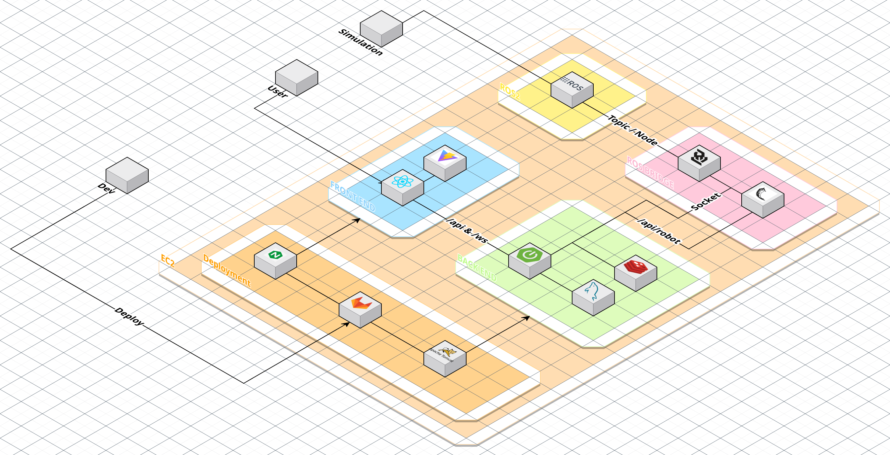
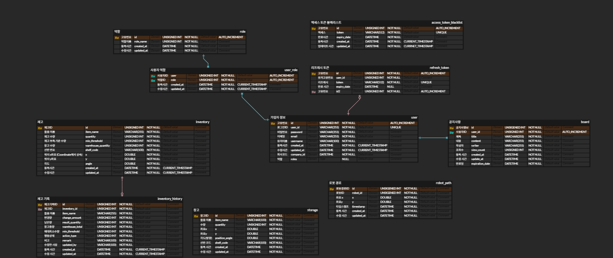

# 🍁창고형 매장을 위한 물품 재고관리 및 자율주행 서비스 **웰던**

---

## ✅프로젝트 진행 기간

2025.03.04 ~ 2025.04.11(6주)

---

## 프로젝트 기획회의 및 규칙 정리 노션

[https://hushed-ferret-748.notion.site/Team-Project-Well-Done-1a46bc9b9c5580b59c19f875fd960071](https://www.notion.so/Team-Project-Well-Done-1a46bc9b9c5580b59c19f875fd960071?pvs=21)

---

## 🚩 서비스 한줄 소개

자율주행 로봇과 웹 서비스를 연동한 실시간 재고 관리 및 물류 자동화 서비스

---

## 📌 개요

Well-Done은 창고형 매장에서 발생하는 재고 관리와 물류 이동을 자동화하기 위한 서비스입니다.
ROS2 기반 시뮬레이터와 웹 서비스를 연결하여, 로봇의 상태 및 위치를 실시간으로 확인하고 제어할 수 있습니다.

---

## 🌱 프로젝트 목표

- 🤖 시뮬레이터에서 로봇의 자율주행을 구현
- 📷YOLO 기반 객체 인식을 통해 창고 내 물품을 식별
- 🧠 백엔드에서 로봇 위치 및 재고 데이터를 가공 + Redis에 저장하여 실시간 처리
- 📊 사용자 웹 페이지에서 로봇 경로 및 재고 현황을 시각화하여 제공

---

## 🚀 주요 기능

### 1. 자율주행 기반 창고 탐색 및 이동

로봇이 창고를 스스로 탐색하고 목적지까지 이동

환경에 따라 경로를 자동으로 변경

### 2. 물품 인식 및 위치 파악

창고 내 물품을 인식하고 위치를 확인

로봇 작업 대상 물품을 자동으로 식별

### 3.자동 재고 보충 및 물류 이동

재고 부족 시 로봇이 물품을 자동으로 이동

물품 집기 및 배치를 자동으로 수행

### 4.실시간 로봇 상태 및 위치 확인

로봇의 위치, 상태, 이동 경로를 실시간으로 확인

현재 작업 진행 상황을 즉시 파악 가능

### 5.창고 맵 및 재고 시각화

웹 화면에서 창고 구조와 로봇 경로를 시각화

재고 상태를 직관적으로 확인 가능

---

## **🧪 주요 기술**

### 1.ROS2 기반 자율주행 및 SLAM

- ROS2 기반 SLAM을 통해 환경을 탐색하고 실시간 맵 생성
- Frontier 탐색 알고리즘을 활용하여 미개척 영역 자동 탐색
- A* 기반 경로 생성 및 장애물 회피 로직 적용
- 로봇이 스스로 창고 환경을 인식하고 최적 경로로 이동 가능

### 2.YOLO 기반 물품 인식 및 위치 파악

- YOLOv8을 활용하여 창고 내 물품을 실시간 인식
- 객체 중심 좌표 추출을 통해 로봇 작업 대상 위치 계산
- 물품 식별 자동화로 재고 관리 정확도 향상

### 3.ROS Bridge 기반 데이터 연동

- ROS 메시지를 JSON 형태로 변환하여 Backend와 연동
- REST API 기반으로 ROS ↔ Web 시스템 통합
- 이기종 시스템(ROS ↔ Web) 연결 핵심 구조

### 4.Redis 기반 실시간 데이터 처리

- ROS → Backend → Frontend 데이터 흐름 구조 설계
- Redis를 활용하여 로봇 위치 및 맵 데이터를 실시간 캐싱
- WebSocket 기반으로 클라이언트에 즉시 데이터 전달
- 실시간 데이터 처리 성능 개선

---

## 🌐 시스템 아키텍처



```markdown
┌──────────────────────────────┐
│         User (Client)        │
└─────────────┬────────────────┘
              │
              ▼
┌──────────────────────────────┐
│       React Frontend         │
│  - UI / Visualization        │
└─────────────┬────────────────┘
              │ WebSocket / REST API
              ▼
┌──────────────────────────────┐
│       Spring Backend         │
│  - Business Logic            │
│  - Redis (Cache)             │
│  - JWT Authentication        │
└─────────────┬────────────────┘
              │ REST API (/api/robot)
              ▼
┌──────────────────────────────┐
│        ROS Bridge Server     │
│     (Flask + rclpy)          │
└─────────────┬────────────────┘
              │ ROS Topic
              ▼
┌──────────────────────────────┐
│       ROS2 Simulator         │
│   (SLAM / Navigation / AI)   │
└──────────────────────────────┘
```

---

## 📡 통신 구조

### 1️⃣ ROS ↔ Backend (ROS Bridge)

- ROS Topic 데이터를 ROS Bridge에서 수신 후 JSON 형태로 변환
- REST API를 통해 Spring Backend로 전달
- Backend에서 받은 사용자 명령을 ROS Topic으로 publish

👉 ROS와 Web 시스템 간 데이터 변환 및 중계 역할 수행

### 2️⃣ Backend ↔ Frontend

### WebSocket (실시간 데이터)

- 로봇 상태, 위치, 맵 데이터를 실시간으로 전송
- polling 방식 대신 push 기반 통신으로 지연 최소화

### REST API (요청/응답)

- 사용자 요청(재고 조회, 명령 요청 등)을 처리
- 클라이언트 ↔ 서버 간 일반 데이터 통신 담당

👉 실시간 처리(WebSocket)와 요청 처리(REST API) 분리

### 3️⃣ 인증 및 보안

- JWT 기반 인증을 통해 사용자 요청 검증
- REST API 요청 시 토큰을 포함하여 인증 처리

---

## 🛠️ 기술 스택

### **Front-End**

- Vite, React, Nginx

### **Back-End**

- Spring Boot, Flask, JPA

### **Database & Cache**

- MySQL: 사용자, 재고, 로봇 경로 등의 영속 데이터 저장
- Redis:
  - 로봇 위치 및 맵 데이터 등 실시간 데이터 캐싱
  - DB 부하를 줄이기 위한 임시 저장소 역할
  - WebSocket 전송을 위한 빠른 데이터 접근 지원

### **Infrastructure & DevOps**

- Docker, GitLab Runner, AWS EC2, Nginx

### Simulator

- **ROS2 (Eloquent)**: 로봇 운영 체제 기반 미들웨어 (Publisher/Subscriber 구조, 메시지 처리)
- **2D LiDAR (LaserScan)**: 거리 기반 장애물 감지 및 SLAM 기반 맵 생성
- **IMU (Inertial Measurement Unit)**: 자세 추정 및 오도메트리 보정
- **Odometry (속도 기반 위치 추정)**: IMU + 선속도/각속도를 통해 상대 위치 계산
- **SLAM (Simultaneous Localization and Mapping)**: 자율 매핑을 위한 동시적 위치 추정 및 지도 작성

- **YOLOv8 (Object Detection)**: 실시간 물체 인식 및 중심 좌표 추출
- **OpenCV**: 이미지 처리 및 라이다-카메라 정렬, 시각화에 사용
- **RViz2**: 로봇 상태, 맵, 경로 등의 시각화 툴
- **RCLPY**: ROS의 메시지를 json으로 변환해주는 라이브러리

---

## 👨‍💻 팀원

| 이름 | 역할 |
| --- | --- |
| 김지홍[팀장] | Back-End, Simulate |
| 김동현 | Back-End, Infra |
| 전민경 | Back-End |
| 이현석 | Simulate, Back-End |
| 정한균 | Simulate |
| 유지웅 | Front-End |

## 📌 역할 및 담당 업무

### 🖥️ Back-End

### 김지홍 [Back-End, Simulate] (팀장)

- MQTT 구현
- 시뮬레이터 인식 구현

### 김동현 [Back-End, Infra]

- 사내 공지 구현 및 API 개발
- Docker, AWS EC2 기반 인프라 구축 및 배포 환경 구성

### 전민경 [Back-End]

- Spring Security 기반 JWT 인증 구현
- WebSocket 기반 실시간 통신 구조 설계 및 구현
- ROS에서 전달된 데이터를 가공하여 클라이언트에 전달
- Redis를 활용한 실시간 로봇 데이터 관리

### 🦾Simulate

### 이현석 [Simulate, Back-End]

- ROS Bridge 구현을 통한 ROS ↔ Backend 연동
- 시뮬레이터 맵 설계 및 구현

### 정한균 [Simulate]

- SLAM 기반 자율주행 및 맵 생성 기능 구현
- 경로 탐색 및 자율 주행 알고리즘 개발
- 시뮬레이터 물품 운반 알고리즘 구현

### 🎨 Front-End

### 유지웅 [Front-End]

- React 기반 웹 페이지 UI 구성 및 화면 설계
- 로봇 상태 및 재고 정보를 시각화하는 화면 구현
  
---

## 🏛️ ERD



---


## 📂 프로젝트 구조

### Back-end

```
+---be/src
├─main
│  └─java
│      └─com
│          └─be
│              │  BeApplication.java
│              │
│              ├─common
│              │  ├─aop
│              │  │
│              │  ├─auth
│              │  │  │
│              │  │  ├─model
│              │  │  │
│              │  │  └─service
│              │  │
│              │  ├─exception
│              │  │  │
│              │  │  └─handler
│              │  │
│              │  ├─model
│              │  │  └─response
│              │  │          BaseResponseBody.java
│              │  │
│              │  └─util
│              │
│              ├─config
│              │  │  .gitkeep
│              │  │  AdminInitializer.java
│              │  │  RedisConfig.java
│              │  │  RestTemplateConfig.java
│              │  │  SwaggerConfig.java
│              │  │  WebSocketConfig.java
│              │  │
│              │  ├─base
│              │  │      BaseException.java
│              │  │      BaseResponse.java
│              │  │      BaseResponseStatus.java
│              │  │
│              │  └─security
│              │          CustomAccessDeniedHandler.java
│              │          CustomAuthenticationEntryPoint.java
│              │          CustomAuthenticationFilter.java
│              │          CustomAuthFailureHandler.java
│              │          CustomAuthSuccessHandler.java
│              │          CustomLogoutHandler.java
│              │          CustomUserDetails.java
│              │          CustomUserDetailsService.java
│              │          JwtAuthorizationFilter.java
│              │          SecurityConfig.java
│              │
│              ├─connection
│              │  └─mqtt
│              │      ├─config
│              │      │      MqttConfig.java
│              │      │
│              │      ├─controller
│              │      │      MqttController.java
│              │      │
│              │      └─service
│              │              MqttService.java
│              │
│              ├─controller
│              │      HelloController.java
│              │
│              ├─db
│              │  ├─entity
│              │  │      BaseEntity.java
│              │  │      Coordinate.java
│              │  │      Inventory.java
│              │  │      InventoryHistory.java
│              │  │      RobotPath.java
│              │  │      Role.java
│              │  │      Room.java
│              │  │      Storage.java
│              │  │      User.java
│              │  │
│              │  ├─repository
│              │  │      InventoryHistoryRepository.java
│              │  │      InventoryRepository.java
│              │  │      RobotPathRepository.java
│              │  │      RoleRepository.java
│              │  │      RoomRepository.java
│              │  │      StorageRepository.java
│              │  │      UserRepository.java
│              │  │
│              │  └─service
│              │          AuthService.java
│              │          InventoryDataLoader.java
│              │          StorageDataLoader.java
│              │
│              └─domain
│                  ├─auth
│                  │  │  WebSocketAuthInterceptor.java
│                  │  │
│                  │  ├─controller
│                  │  │      AdminController.java
│                  │  │      AuthController.java
│                  │  │      UserController.java
│                  │  │
│                  │  ├─dto
│                  │  │      LoginRequestDto.java
│                  │  │      LoginResponseDto.java
│                  │  │      UserDto.java
│                  │  │
│                  │  ├─request
│                  │  │      LoginRequest.java
│                  │  │      RegisterRequest.java
│                  │  │      UpdateUserRequest.java
│                  │  │
│                  │  ├─response
│                  │  │      LoginResponse.java
│                  │  │      RegisterResponse.java
│                  │  │
│                  │  ├─service
│                  │  │      TokenBlackListService.java
│                  │  │      TokenBlackListServiceImpl.java
│                  │  │
│                  │  └─utils
│                  │          TokenUtils.java
│                  │          ValidTokenDto.java
│                  │
│                  ├─board
│                  │  ├─controller
│                  │  │      BoardController.java
│                  │  │
│                  │  ├─dto
│                  │  │      BoardRequestDto.java
│                  │  │      BoardResponseDto.java
│                  │  │      ExpirationDateRequestDto.java
│                  │  │
│                  │  ├─entity
│                  │  │      Board.java
│                  │  │
│                  │  ├─exception
│                  │  │      GlobalExceptionHandler.java
│                  │  │
│                  │  ├─repository
│                  │  │      BoardRepository.java
│                  │  │
│                  │  └─service
│                  │          BoardService.java
│                  │
│                  ├─inventory
│                  │  ├─controller
│                  │  │      .gitkeep
│                  │  │      InventoryController.java
│                  │  │      InventoryHistoryController.java
│                  │  │
│                  │  ├─dto
│                  │  │      .gitkeep
│                  │  │      InventoryDto.java
│                  │  │      InventoryHistoryDto.java
│                  │  │      RobotCommandDto.java
│                  │  │      StockAlertDto.java
│                  │  │
│                  │  ├─request
│                  │  │
│                  │  ├─response
│                  │  │
│                  │  └─service
│                  │          InventoryHistoryService.java
│                  │          InventoryService.java
│                  │
│                  ├─robot
│                  │  │  RosBridgeClient.java
│                  │  │  SimulatorSocketHandler.java
│                  │  │  UserSocketHandler.java
│                  │  │
│                  │  ├─controller
│                  │  │      .gitkeep
│                  │  │      RedisController.java
│                  │  │      RobotController.java
│                  │  │
│                  │  ├─dto
│                  │  │
│                  │  ├─request
│                  │  │
│                  │  ├─response
│                  │  │
│                  │  └─service
│                  │          RedisService.java
│                  │          RobotLocationService.java
│                  │          RobotService.java
│                  │
│                  ├─room
│                  │  ├─controller
│                  │  │      RoomController.java
│                  │  │
│                  │  ├─request
│                  │  │      RoomRequest.java
│                  │  │
│                  │  └─service
│                  │          RoomService.java
│                  │
│                  └─storage
│                      ├─controller
│                      │      StorageController.java
│                      │
│                      └─service
│                              StorageService.java
│
└─test
    └─java
        └─com
            └─be
                    BeApplicationTests.java

```


### Front-end

```
+---fe/src
│  App.css
│  App.jsx
│  index.css
│  main.jsx
│
├─assets
│      bgimage.png
│      logo.png
│
├─components
│  │  AlertModal.jsx
│  │  ErrorBoundary.jsx
│  │  LoginForm.jsx
│  │  Logout.jsx
│  │  RegisterForm.jsx
│  │
│  ├─atoms
│  │  ├─NavItem
│  │  │      NavItem.css
│  │  │      NavItem.jsx
│  │  │
│  │  └─Toast
│  │          Toast.css
│  │          Toast.jsx
│  │
│  ├─board
│  │      AnnouncementDetail.css
│  │      AnnouncementDetail.jsx
│  │      AnnouncementForm.css
│  │      AnnouncementForm.jsx
│  │      AnnouncementList.css
│  │      AnnouncementList.jsx
│  │
│  ├─Inventory
│  │      InventoryForm.jsx
│  │      InventoryHistory.jsx
│  │      InventoryItem.jsx
│  │      InventoryList.jsx
│  │
│  ├─Layout
│  │      Footer.jsx
│  │      Header.jsx
│  │      Layout.jsx
│  │
│  ├─Map
│  │      MapCanvas.jsx
│  │      MapControls.jsx
│  │      MapInfo.jsx
│  │
│  ├─Robot
│  │      RobotCard.jsx
│  │      RobotDetailsModal.jsx
│  │
│  └─templates
│          .gitkeep
│
├─configs
│      env.js
│
├─hooks
│      useAuth.js
│      useInventory.js
│      useLocation.js
│      useToast.js
│
├─pages
│      InventoryDetailPage.jsx
│      InventoryPage.jsx
│      LoginPage.jsx
│      LogPage.jsx
│      MainPage.jsx
│      MapPage.jsx
│      MapPageOld.jsx
│      RegisterPage.jsx
│      RobotPage.jsx
│      SettingsPage.jsx
│      WorkPage.jsx
│
├─routes
│      AppRoutes.jsx
│
├─services
│      .gitkeep
│      errorService.js
│      inventoryService.js
│
├─stores
│      authStore.js
│      inventoryStore.js
│      toastStore.js
│
├─styles
│      AuthForm.css
│      HeaderStyles.css
│      InventoryStyles.css
│      RobotPage.module.css
│      RobotStyles.css
│
└─utils
        api.js
        mapUtils.js
        robotData.js
```

### ROS2 & Simulator

```
📦 프로젝트 루트
├── .gitignore
├── README.md
├── bridge                    # Flask + ROS 브릿지 서버
│   ├── RosBridge.py
│   ├── RosBridge_v4.py
│   └── RosBridge_Modulized/
│       ├── flask_server.py
│       ├── ros_node.py
│       ├── handlers/        # 명령 및 콜백 처리
│       └── utils/           # 인증 및 메시지 변환 유틸
├── sim/
│   ├── ros2_ws/
│   │   ├── map/             # 시뮬레이터 맵 리소스
│   │   └── src/
│   │       └── ros2_smart_home/
│   │           ├── ssafy_bridge/      # 센서 데이터 처리 노드
│   │           ├── ssafy_msgs/        # 커스텀 메시지 정의
│   │           └── warehouse_bot/     # 메인 ROS 기능 노드 모음
│   │               ├── controller/        # 경로 추적, 정렬
│   │               ├── navigation/        # A* 경로 생성
│   │               ├── perception/        # 객체 인식 및 변환기
│   │               ├── pick_and_place/    # 집기/배치 FSM
│   │               ├── slam/              # SLAM 매핑, 오도메트리
│   │               ├── trace_path/        # 경로 기록 노드
│   │               └── utils/             # 공통 유틸
│   └── simulator/
│       └── map data/         # 시뮬레이터 장애물 및 맵 데이터

```

---
